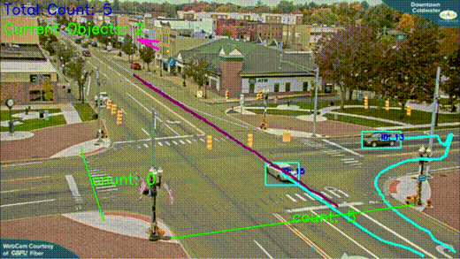
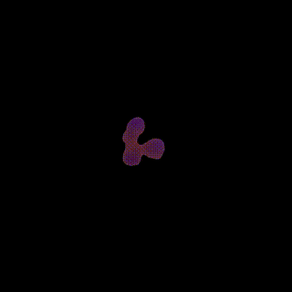
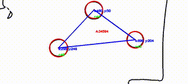

# ComputerVisionProjects
This repository contains miscellaneous small computer vision projects using mostly OpenCV and Python.

## Project Demos

### Object Counting

Counts and tracks objects.

### Morphological Segmentation

Morph image to separate jointed cells automatically.

### Circle Detection

Detects circles to calculate triangle axis.

